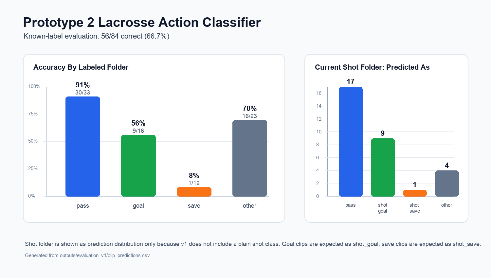

# Prototype 2: Lacrosse Action Classifier

This project is an early prototype for classifying short lacrosse video clips by play type. The current model is a clip-level classifier: each short `.mp4` clip is assigned one label based on the main action in the clip.

Current labels:

- `pass`
- `shot_goal`
- `shot_save`
- `other`

The first prototype does not use player detection, ball detection, or tracking yet. It samples frames from the full video frame with OpenCV and trains a small PyTorch neural network to classify the clip.

## Current Results

Evaluation across the labeled clips produced:

- Overall known-label accuracy: `56/84`, or `66.7%`
- `pass`: `30/33`, or `91%`
- `goal` mapped to `shot_goal`: `9/16`, or `56%`
- `save` mapped to `shot_save`: `1/12`, or `8%`
- `other`: `16/23`, or `70%`



The main takeaway is that the model is already strong on passes, is starting to learn goals, and needs more clean `shot_save` examples.

## Project Structure

```text
Prototype 2/
  data/
    action_clips/
      train/
        pass/
        goal/
        save/
        other/
        shot/
      val/
        pass/
        goal/
        save/
        other/
        shot/
  models/
    action_classifier_v1/
      labels.json
  outputs/
    evaluation_v1/
      action_classifier_summary.png
      clip_predictions.csv
      summary.json
  scripts/
    train_action_classifier.py
    predict_action.py
    evaluate_action_classifier.py
```

Training videos and `.pt` model weights are intentionally not committed to GitHub. The clips can contain private footage and model weights can become large. The repo keeps code, folder structure, metadata, and evaluation results.

## Setup

From the project folder:

```bash
python3 -m venv .venv
source .venv/bin/activate
pip install -r requirements.txt
```

## Train

Put short clips into the matching class folders under `data/action_clips/train` and `data/action_clips/val`.

Then run:

```bash
python3 scripts/train_action_classifier.py \
  --data data/action_clips \
  --output models/action_classifier_v1 \
  --epochs 12 \
  --batch-size 8 \
  --frames 8 \
  --size 96
```

The current training script maps folders like this:

```text
pass -> pass
goal -> shot_goal
save -> shot_save
other -> other
```

The `shot` folder is not used for training in v1 because the current model does not have a plain `shot` class.

## Predict One Clip

```bash
python3 scripts/predict_action.py \
  --model models/action_classifier_v1/best.pt \
  --clip "path/to/test_clip.mp4"
```

## Evaluate All Clips

```bash
python3 scripts/evaluate_action_classifier.py \
  --model models/action_classifier_v1/best.pt \
  --data data/action_clips \
  --output-dir outputs/evaluation_v1
```

## Benchmark Against OpenAI Vision

This project can also benchmark the same clips against an OpenAI vision model by sampling frames from each `.mp4` and asking the model to classify the clip.

Set your API key locally:

```bash
export OPENAI_API_KEY="your_api_key_here"
```

Then run:

```bash
python3 scripts/benchmark_openai_vlm.py \
  --data data/action_clips \
  --output outputs/openai_vlm_benchmark/openai_predictions.csv \
  --model gpt-5.5 \
  --frames 6
```

Summarize the results:

```bash
python3 scripts/summarize_vlm_benchmark.py \
  --csv outputs/openai_vlm_benchmark/openai_predictions.csv
```

Do not commit API keys, `.env` files, video clips, or `.pt` model weights.

## Next Steps

- Add more clean `shot_save` clips.
- Tighten clips so each one has one main event.
- Retrain as `action_classifier_v2`.
- Add a Streamlit upload app for easier testing.
- Later add YOLO-based player, goalie, and ball detection for better context.
