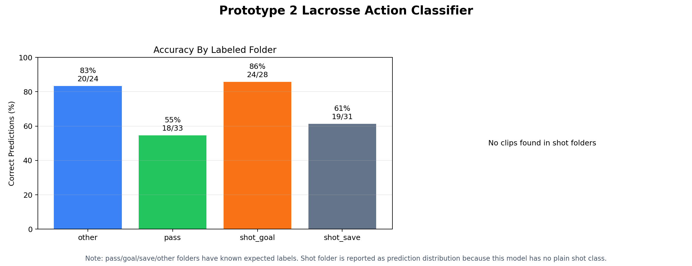

# Prototype 2: Lacrosse Action Classifier

This project is an early prototype for lacrosse action understanding. The current model is a clip-level classifier: each short `.mp4` clip gets one label based on the main action in the clip.

Current labels:

- `pass`
- `shot_goal`
- `shot_save`
- `other`

The next milestone is temporal action detection: running the classifier over a longer game clip with overlapping windows, then merging those predictions into a timestamped event timeline.

## Current No-Leakage Results

The latest four-class model was trained on `data/action_clips/no_leakage`. The shot goal/save validation games are separated from the shot training games, and pass/other use a more careful scorebox split than the original random-style setup.

- Overall accuracy across train+val clips: `81/116`, or `69.8%`
- Validation accuracy: `25/35`, or `71.4%`
- `pass` validation accuracy: `5/8`, or `62.5%`
- `shot_goal` validation accuracy: `10/12`, or `83.3%`
- `shot_save` validation accuracy: `6/9`, or `66.7%`
- `other` validation accuracy: `4/6`, or `66.7%`



The main takeaway is that the project now has a cleaner benchmark. The model is not production-ready yet, but the scores are more believable than the first split because validation clips are less likely to be near-duplicates from the same moments.

## Project Structure

```text
Prototype 2/
  data/
    action_clips/
      no_leakage/
        train/
          pass/
          other/
          shot_goal/
          shot_save/
        val/
          pass/
          other/
          shot_goal/
          shot_save/
  models/
    action_classifier_no_leakage_v1/
      labels.json
  outputs/
    no_leakage_evaluation_v1/
      action_classifier_summary.png
      clip_predictions.csv
    long_video_predictions/
  scripts/
    train_action_classifier.py
    predict_action.py
    long_video_predict.py
    evaluate_action_classifier.py
```

Training videos and `.pt` model weights are intentionally not committed to GitHub. The clips can contain private footage and model weights can become large. The repo keeps code, folder structure, metadata, and evaluation results.

## Setup

From the project folder:

```bash
python3 -m venv .venv
source .venv/bin/activate
pip install -r requirements.txt
```

## Train The Current Four-Class Model

Put short clips into the matching class folders under `data/action_clips/no_leakage/train` and `data/action_clips/no_leakage/val`.

Then run:

```bash
python3 scripts/train_action_classifier.py \
  --data data/action_clips/no_leakage \
  --output models/action_classifier_no_leakage_v1 \
  --epochs 12 \
  --batch-size 8 \
  --frames 16 \
  --size 112 \
  --label-map no_leakage_actions
```

The current no-leakage training script maps folders like this:

```text
pass -> pass
other -> other
shot_goal -> shot_goal
shot_save -> shot_save
```

## Predict One Short Clip

```bash
python3 scripts/predict_action.py \
  --model models/action_classifier_no_leakage_v1/best.pt \
  --clip "path/to/test_clip.mp4"
```

## Predict A Longer Video Timeline

Use `long_video_predict.py` when you want to test a longer lacrosse video and produce timestamps.

```bash
python3 scripts/long_video_predict.py \
  --model models/action_classifier_no_leakage_v1/best.pt \
  --video "/Users/zllenza/Downloads/testPROTO.mp4" \
  --output-dir outputs/long_video_predictions/testPROTO \
  --window-seconds 3 \
  --stride-seconds 1 \
  --threshold 0.55
```

The script creates overlapping windows:

```text
0.0s - 3.0s
1.0s - 4.0s
2.0s - 5.0s
...
```

Then it classifies each window, smooths nearby predictions, merges repeated labels, and writes:

```text
outputs/long_video_predictions/testPROTO/predictions_windows.csv
outputs/long_video_predictions/testPROTO/predictions_events.csv
outputs/long_video_predictions/testPROTO/predictions_events.json
```

The event JSON is the first bridge toward full event segmentation:

```json
[
  {
    "start": 12.0,
    "end": 15.0,
    "timestamp": "00:12.00 - 00:15.00",
    "label": "pass",
    "confidence": 0.82
  }
]
```

## Evaluate All Clips

```bash
python3 scripts/evaluate_action_classifier.py \
  --model models/action_classifier_no_leakage_v1/best.pt \
  --data data/action_clips/no_leakage \
  --output-dir outputs/no_leakage_evaluation_v1
```

## Benchmark Against OpenAI Vision

This project can also benchmark the same clips against an OpenAI vision model by sampling frames from each `.mp4` and asking the model to classify the clip.

Set your API key locally:

```bash
export OPENAI_API_KEY="your_api_key_here"
```

Then run:

```bash
python3 scripts/benchmark_openai_vlm.py \
  --data data/action_clips \
  --output outputs/openai_vlm_benchmark/openai_predictions.csv \
  --model gpt-5.5 \
  --frames 6
```

Summarize the results:

```bash
python3 scripts/summarize_vlm_benchmark.py \
  --csv outputs/openai_vlm_benchmark/openai_predictions.csv
```

Do not commit API keys, `.env` files, video clips, or `.pt` model weights.

## Next Steps

- Test `long_video_predict.py` on a 1-3 minute lacrosse clip.
- Review `predictions_windows.csv` to see where the model is confused.
- Save corrected event timestamps as training labels.
- Add a Streamlit app that lets a user upload video, inspect the timeline, correct labels, and export corrected data.
- Later add YOLO-based player, goalie, and ball/possession detection for stronger context.
